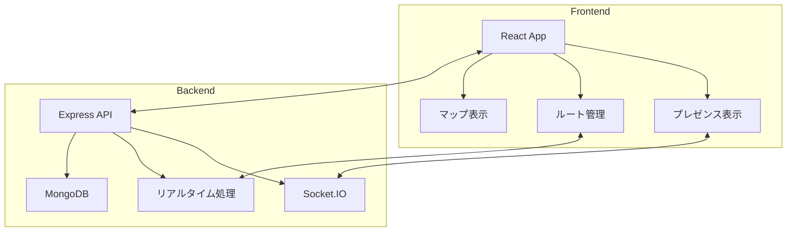

---
# ドキュメント情報
プロジェクト: PintHop
ファイル名: architecture.md
ファイルパス: Document/jp/architecture.md
作成者: AI Assistant
作成日: 2025-05-24

# 更新履歴
- 2025-05-24 AI Assistant 初版作成

---

# システムアーキテクチャ概要

PintHopは偶然の出会いとコミュニティ形成を中心としたビアホッピングプラットフォームです。リアルタイムプレゼンス共有とルート共有を核心機能としています。

※ ビール発見・評価機能はNextPint（https://github.com/Rih0z/NextPint）で提供

以下は PintHop の主要コンポーネント間の関係を示す図です。

## 主要コンポーネント

### Frontend
- **React + TypeScript**: コンポーネントベースのUI構築
- **Leaflet.js**: 地図表示とプレゼンスマーカー
- **Socket.IO Client**: リアルタイムプレゼンス更新
- **React Context**: プレゼンス状態管理

### Backend
- **Node.js + Express**: RESTful APIサーバー
- **Socket.IO**: リアルタイムプレゼンス通信
- **JWT認証**: セキュアなユーザー認証
- **ルート最適化エンジン**: 混雑度を考慮したルート提案

### Database
- **MongoDB 7.x**: NoSQLデータベース
- **主要コレクション**:
  - Users: ユーザー情報とプライバシー設定
  - Breweries: ブルワリー基本情報（共有データベース候補）
  - Presence: リアルタイム位置情報
  - Routes: ホッピングルート
  - Checkins: 訪問履歴
  - Events: コミュニティイベント

### 共有ブルワリーデータベース構想
PintHopとNextPintで共有するブルワリー基本情報：
- **基本情報**: 名前、住所、営業時間、連絡先
- **受賞歴**: GABF、WBC等の受賞記録
- **得意スタイル**: ブルワリーの特徴的なビアスタイル
- **外部レビューサイト**: Yelp、Google、Untappd等のリンク

実装アプローチ：
1. **マイクロサービス**: 独立したブルワリーAPIサービス
2. **共有MongoDB**: 両アプリから接続可能なデータベース
3. **GraphQL Federation**: 柔軟なデータクエリ

## データフロー

### プレゼンス共有
1. ユーザーがブルワリーにチェックイン
2. Socket.IOでリアルタイムで友達に通知
3. 地図上にプレゼンスマーカーを表示
4. 滞在時間を自動記録

### ルート共有
1. ユーザーがホッピングルートを作成
2. 友達をルートに招待
3. リアルタイムでルート進行状況を共有
4. 混雑度に応じてルートを動的に調整

## セキュリティアーキテクチャ

- **JWTトークン**: ステートレスな認証
- **プライバシー設定**: 柔軟なプレゼンス共有制御
- **HTTPS**: すべての通信を暗号化
- **位置情報保護**: 最小限の精度で共有

## スケーラビリティ

- **水平スケーリング**: PM2によるクラスタリング
- **キャッシュ戦略**: Redisでのセッション管理（将来実装）
- **CDN**: 静的アセットの配信最適化

## CI/CD

GitHub Actions を利用し、テスト・ビルド・デプロイを自動化します。

- **テスト**: Jestによるユニットテスト
- **ビルド**: TypeScriptコンパイルと最適化
- **デプロイ**: Netlify（Frontend）、PM2（Backend）
