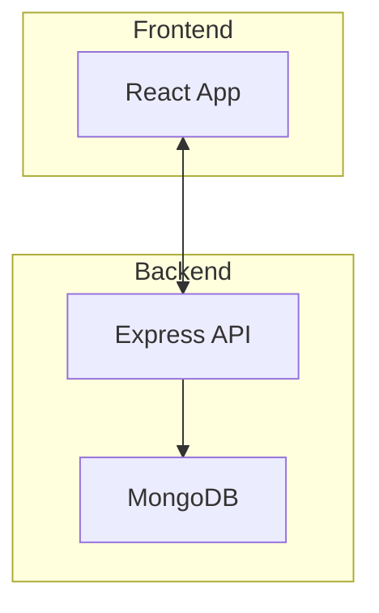

---
# ドキュメント情報
プロジェクト: PintHop
ファイル名: architecture.md
ファイルパス: Document/jp/architecture.md
作成者: AI Assistant
作成日: 2025-05-24

# 更新履歴
- 2025-05-24 AI Assistant 初版作成

---

# システムアーキテクチャ概要

以下は PintHop の主要コンポーネント間の関係を示す図です。

- **Frontend**: React + TypeScript, Leaflet を用いた地図表示。
- **Backend**: Node.js + Express。Socket.IO でリアルタイム通信を提供。
- **Database**: MongoDB 7.x。ユーザー、ブルワリー、ビール等のデータを保存。

CI/CD は GitHub Actions を利用し、テスト・ビルド・デプロイを自動化します。
